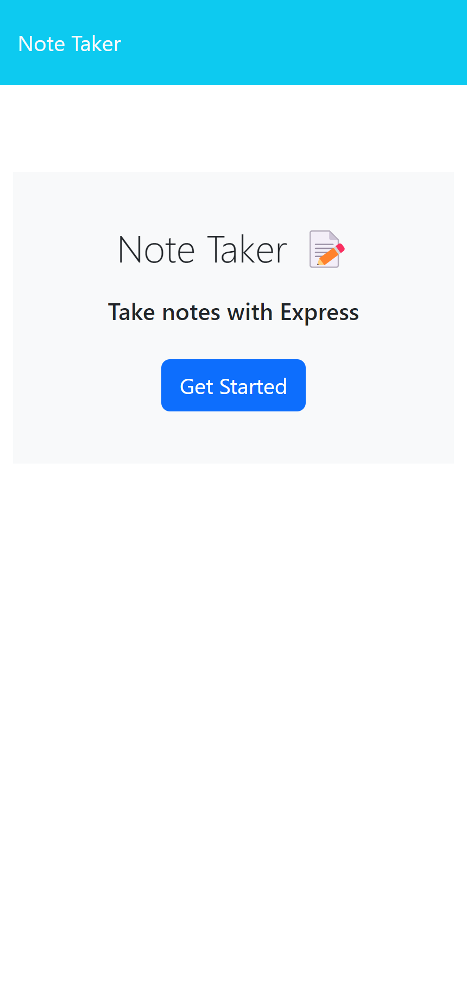
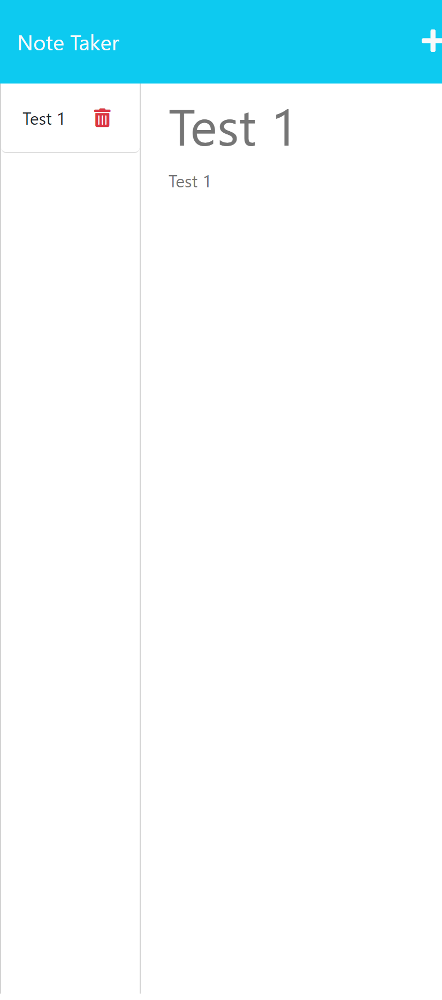

 # express-not-taker

  

  ## Table-of-Contents

  * [Description](#description)
  * [Installation](#installation)
  * [Usage](#usage)
  * [Screenshot](#screenshot)
  * [Credits](#credits)
  * [Tests](#tests)
  * [Questions](#questions)
  
  ## [Description](#table-of-contents)

  This project is a Note Taker website that allows users to add text to a title and text area to save notes for later. Multiple notes can be saved as it is persistent data and you can delete old notes. This project allows for organization of note text for the user to use in any format.

  I created this project as a challenge for the Georgia Tech Coding Bootcamp. This texts my skills with using Express.js and making my own APIs to serve on local hosts.

  THere are two reasons to use this project: A person can use the application to physically take notes and use these notes for whatever reason they took them or to view the application and its code to see how Express.js operates.

  ## [Installation](#table-of-contents)

  The best way to install this project is to clone the code from my github repository to your local device. You can do this with a SSH key or the HTTPS. Once downloaded to your device, you need to have node.js, express.js, and the npm package installed into your codes terminal so you can operate the project.

  ## [Usage](#table-of-contents)

  To operate the project, you need to have Node.js and Express.js installed into your codes terminal platform. From here you need to ensure youre in the correct path of the code which should be "Develop". From here, you can enter "npm start" which will start express and you can view the application with the URL "localhost:3001". Now that we use Heroku. You can do the same by using "heroku open" on your device to display the page without having a local host.

  ## [Screenshot](#table-of-contents)

  

  
  
  ## [Credits](#table-of-contents)s

  This is completed for a class so no contribution is needed.

  
  ## [License](#table-of-contents)

  This application is under the following license:

  [mit](https://choosealicense.com/licenses/mit)
    
  
  ## [Tests](#table-of-contents)

  There is no tests for this project but ensuring it operates correctly with npm start is imperative.

  ## [Questions](#table-of-contents)

  Contact Information:

  GitHub: (https://github.com/AaronDreyer)

  Email: aaronottaway@gmail.com

